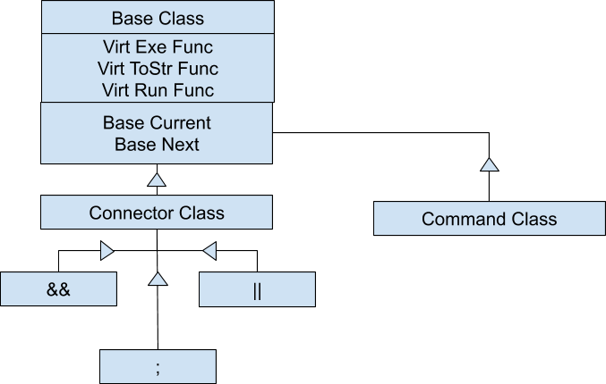

# CS 100 Programming Project

## Project Info

- Winter 2020 
- Steven Joseph - 862083506 - sjose007@ucr.edu
- Nathanael Holmes - 862010704 - nholm002@ucr.edu

## Introduction

The goal of this program is to create a CLI Shell that can execute programs and commands as well as identify whether or not they succeed or fail. We will also incorporate logical connectors like &&, ||, and ; that rely on this knowledge of whether or not a particular command executes properly. The main design pattern we will be implementing is the Composite Pattern. We will have a base class from which several child classes will inherit from. When user input is recieved we will determine what class each portion belongs to. These children will be a command class and a logical connector class, as well as an argument and execute class potentially.

## Diagram

## Classes

### Base
A generic abstract class meant to act as the Base of the program.

### Connector
Conector will be a super class for all connectors to inherit from: "&& || ;".

### Semicolon, And, Or
Derived classes from Connector which will act as connecting statements with consideration for execute() function.

### Command
The command themselves, but maybe with different implementation, but things along the lines of "ls" or "echo".  
This will contain a `char**` that holds the command, and will be filled by `vector<string>`
Will have CommandLine store all Commands in an array. 
A public variable will be used to mark and store the root node. 
The idea is a binary tree with the leaves being Command data, inteded to use inorder traversal.
Note:Unsure if this is final implementation.

## Prototypes/Research

## Development and Testing Roadmap

- Create TOKENIZER class to seperate user input string into individual strings
- Unit Test TOKENIZER class
- Create a parser to parse user input
- Unit Test Parser
- Integration Test TOKENIZER with parser
- Make AND class
- Unit Test AND class
- Integration Test AND with user input
- Make OR class
- Unit Test OR class
- Integration Test OR with user input and AND
- Make SEMICOLON class
- Unit Test SEMICOLON class
- Integration Test SEMICOLON with OR, AND, and user input
- Make COMMENT class
- Unit Test COMMENT class
- Integration Test COMMENT with OR, AND, SEMICOLON, and user input
